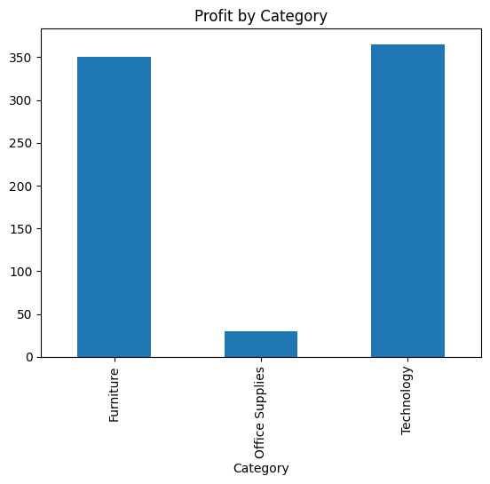

# Retail Sales Analysis

## Project Overview

This project analyzes retail sales data using Python.

## Tools Used

* Python
* Pandas
* Matplotlib
* Seaborn

## Project Structure

* data/ : Dataset files
* images/ : Generated charts
* notebooks/ : Analysis scripts
* reports/ : Project report

## Visualizations

### Sales by Category

### Profit by Category

## Conclusion

This project demonstrates data analysis, visualization, and reporting using retail sales data.
